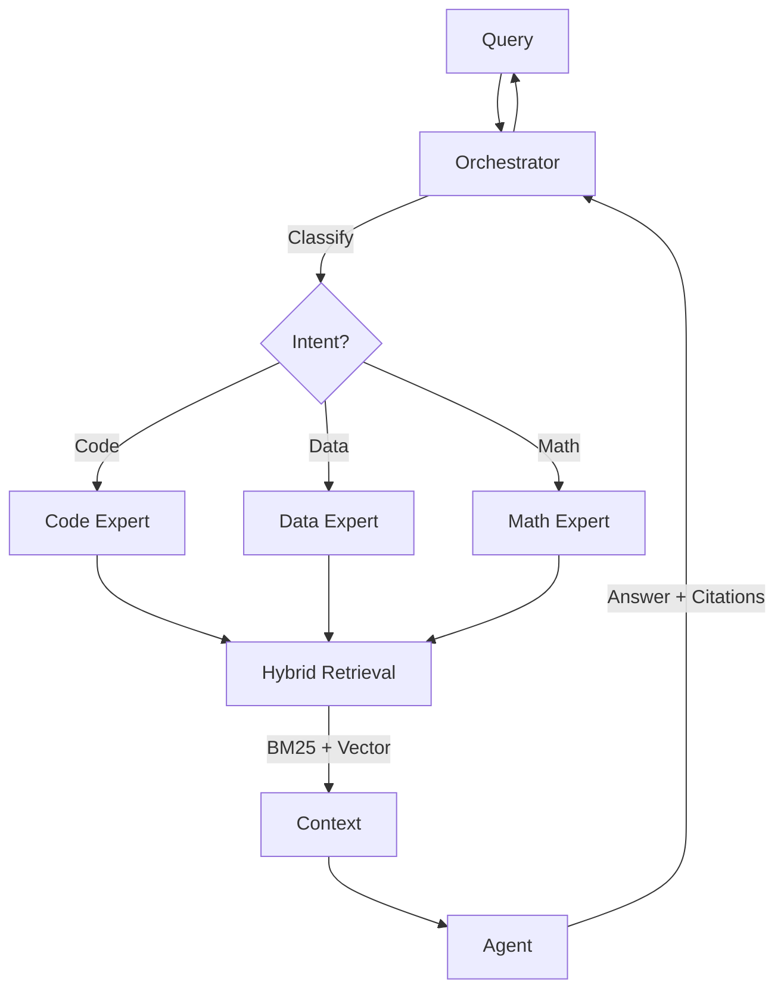

# CodeXRAG: State-of-the-Art Multi-Agent Scientific RAG

[]()
[]()
[]()

**CodeXRAG** is a Verified Research Assistant designed specifically for scientific codebases. Unlike generic RAG tools, it understands the structure of research code (Python, C++, Jupyter Notebooks), parses scientific data (CSV, HDF5 outputs), and enforces strict safety and citation protocols.

## 🚀 Features

- **Multi-Agent Orchestrator**: Automatically routes queries to specialized experts:
  - 🧠 **Code Analyst**: Understands class hierarchies and function logic.
  - 📊 **Data Expert**: Interprets CSV/HDF5 schemas and plots.
  - 📚 **Doc Expert**: Cites papers and markdown documentation.
  - 📐 **Math Expert**: Explains physics formulas/LaTeX.

- **Scientific Parsing Engine**:
  - **AST-Aware**: Parses Python/C++ logic blocks, not just text chunks.
  - **Notebook Intelligence**: extract code & markdown cells individually.
  - **Robustness**: Gracefully handles corrupted scientific data files.

- **Safety & Security**:
  - **Zero-Deletion Guarantee**: Only performs read-only operations.
  - **Audit Trail**: Logs every query and index operation to `.codexrag/audit.log`.

## 📦 Installation

```bash
# one-click setup (recommended)
./setup_env.sh

# Activate environment
source .venv/bin/activate
```

## ⚡ Usage

### 1. Index Your Codebase (First Run)
Navigate to your project root and run the indexer.
```bash
# Run from your project root
codexrag index --repo . --config rag4mycodex/config.yaml
```

### 2. Ask a Question
Get a precise answer with citations.
```bash
codexrag ask --repo . --question "Where is RpA computed and how?"
```

### 3. Interactive Chat
Start a session with your research assistant.
```bash
codexrag chat --repo .
```
> **Tip**: Type `exit` to quit.

### 4. Safety Audit
View the security log.
```bash
codexrag audit --repo .
```

## 🏗️ Architecture

CodeXRAG uses a **Subagent Pattern** with Centralized Orchestration:



## 🔧 Configuration

Edit `rag4mycodex/config.yaml` to customize:
- `include_globs`: What files to index (e.g., `**/*.py`, `**/*.ipynb`)
- `ollama_model`: The LLM to use (`qwen2.5-coder:14b` recommended)
- `top_k_vector`: Number of chunks to retrieve

## 📄 License

MIT License. Built for the Scientific Computing Community.
