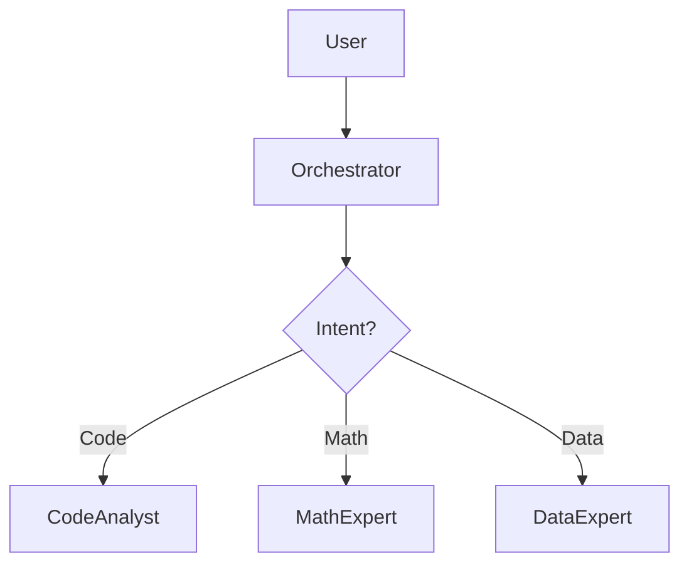

# Scientific RAG Concepts: How CodeXRAG Works

> "Retrieval-Augmented Generation (RAG) is to LLMs what an open-book exam is to students."

This document explains the **Physics-Aware Architecture** used in CodeXRAG, designed to serve as a reference for the scientific community.

## 1. The Challenge of Scientific Code

Standard RAG systems (like Chat with PDF) fail on scientific codebases because:
1.  **Code Logic**: Functions depend on imports from other files (e.g., `compute_rpa` calls `glauber_model`). Simple text splitting breaks this context.
2.  **Formulas**: Equations like $R_{pA}$ are often implemented across multiple lines of Python/C++, making them hard to search.
3.  **Data Formats**: Results are in `.csv` or `.h5` files, which LLMs cannot natively "read" without parsing.

## 2. Our Solution: Multi-Agent "Subagent" Architecture

CodeXRAG uses a **Orchestrator-Workers** pattern.

### 🧠 The Agents

-   **Orchestrator**: The "PI" (Principal Investigator). It doesn't do the work; it delegates.
-   **CodeAnalyst**: Uses Python AST (Abstract Syntax Tree) to parse code *logically*. It knows that `def compute_rpa():` is a function block, not just random text.
-   **MathExpert**: Trained to look for LaTeX strings in docstrings and map them to code implementations.

## 3. The "Hybrid Retrieval" Engine

We don't rely on just one search method. We use **Hybrid Search**:

1.  **Dense Retrieval (Vector)**: Uses embeddings (all-MiniLM-L6-v2) to find *semantic* matches.
    *   *Query*: "How do we normalize the cross section?"
    *   *Match*: `def normalize_sigma(): ...` (Conceptually similar)
2.  **Sparse Retrieval (BM25)**: Uses keyword matching (TF-IDF).
    *   *Query*: "What is the value of parameter `alpha_s`?"
    *   *Match*: `alpha_s = 0.2` (Exact keyword match)

## 4. Safety & Verification

In science, correctness is paramount.
*   **Zero-Deletion**: The `SafetyAgent` intercepts every OS call. If an agent tries to `os.remove()`, it is blocked immediately.
*   **Audit Trail**: Every answer is logged. If the bot hallucinates, you can check the logs to see exactly *which* file it read.

## 5. How to Fork & Contribute

1.  **Fork** this repository.
2.  **Create a New Expert**: Add a new agent in `codexrag/agents/`.
3.  **Test**: Run `pytest tests/` to verify your agent doesn't break the Golden Set.
